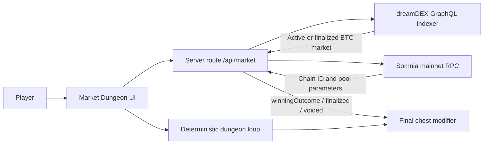

# Market Dungeon

Market Dungeon is a playable fantasy roguelite built for the **Somnia × dreamDEX Event Contracts Hackathon**. A live BTC 15-minute Event Contract becomes a dungeon omen: choose **Gold Awakens (UP)** or **Shadows Rise (DOWN)**, clear ten rooms, defeat the Dungeon Lord, and let the finalized onchain outcome modify the last chest.

The current contest build is intentionally read-only. It reads live market and settlement data, verifies Somnia mainnet, and never requests a wallet signature, token approval, or trade.

## Live demo

**Play:** https://market-dungeon.vtalityinnovation.chatgpt.site

### Full live expedition

1. Choose `GOLD AWAKENS` or `SHADOWS RISE` against the active BTC market.
2. Enter the dungeon and clear ten deterministic combat rooms.
3. Use potions and gold, including Quartermaster Kevin's shops after Room 5 and the final boss.
4. Open the final chest after dreamDEX finalizes the Event Contract.
5. A correct omen adds 50 gold; an incorrect omen removes up to 20 gold. Combat success is never overridden.

### Two-minute Judge Demo

Select **2-MIN JUDGE DEMO · REAL MARKET REPLAY** on the start screen. This mode:

- queries the latest finalized BTC 15-minute Event Contract;
- starts at the final boss with an explicit `JUDGE DEMO` label;
- preserves the player's chosen UP/DOWN omen;
- requires the player to defeat the boss and open the chest; and
- resolves the chest from that market's real recorded Somnia outcome.

It is a fast replay, not a mocked settlement.

## Why Event Contracts fit the game

Market Dungeon separates skill from prediction:

- **Dungeon result:** deterministic player actions, damage, healing, inventory, and room progression.
- **Market result:** dreamDEX changes only the final hoard after the dungeon is complete.

This prevents a market call from erasing the player's run while still making the Event Contract meaningful and visible throughout the experience.

## Architecture



### Trust boundaries

- The browser never receives a private key.
- The app sends no approval, order, redemption, or other transaction.
- Server responses use `cache-control: no-store` for time-sensitive market state.
- The API verifies Somnia chain ID `5031` before returning a playable market.
- Judge Demo data is selected from finalized, non-voided BTC markets with a recorded outcome.

## Verified integration surface

Verified against Somnia mainnet on 24 August 2026:

| Surface | Value |
| --- | --- |
| Somnia chain ID | `5031` |
| dreamDEX indexer | `https://prd.smk.somnia.host/v1/graphql` |
| Somnia RPC | `https://api.infra.mainnet.somnia.network` |
| BinaryModule | `0x3ecC694Cef705358864a646142ac17A90E29e388` |
| BinarySettlement | `0xbF4a49e0Dfd092e5FBE8E5761064C49533e6Ed23` |
| USDso collateral | `0x00000022dA000002656c64D9eA6011ea952D008A` |
| Market filter | `BINARY` · `BTC` · `900` seconds |
| Settlement fields | `finalized`, `voided`, `winningOutcome`, `payoutNumerators`, `payoutDenominator` |

Active-market discovery uses dreamDEX's indexer. Opening strike resolution follows `MarketReferenceLink.referenceQuestionId` to `OracleAnswer.numericValue`. Pool tick, minimum quantity, and lot size are read directly through Somnia RPC.

## Local development

Requirements: Node.js 22.13 or newer.

```bash
npm install
npm run dev
```

Then open the local URL printed by the development server.

### Validation

```bash
npm run lint
npm run build
```

## Project structure

```text
app/
  api/market/route.ts   Live market discovery and finalized replay lookup
  globals.css           Responsive game presentation
  layout.tsx            Metadata and social preview configuration
  page.tsx              Complete ten-room game and Judge Demo state machine
public/
  assets/                Canonical Delveworn gold coin
  characters/            Travelling merchant artwork
  monsters/              Four progression tiers for each enemy class
```

## Safety and current limitations

- Event Contracts use real assets on mainnet; this contest build does not trade.
- The interface must not be used to bypass dreamDEX eligibility or jurisdiction checks.
- A future wallet-enabled mode should use exact-amount approval, transaction simulation, explicit maximum-loss disclosure, and separate user confirmation for every write.
- The game currently keeps expedition state in the browser only; refreshing resets the run.
- Availability depends on the public dreamDEX indexer and Somnia RPC.

## Contest status

- Playable deployed experience: complete
- Live active-market integration: complete
- Finalized onchain settlement replay: complete
- Two-minute judge path: complete
- Wallet writes: intentionally disabled

## License

MIT
