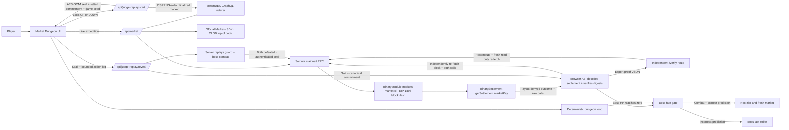

# Market Dungeon

**Defeat the boss. Predict the market. Survive both.**

Market Dungeon is a playable fantasy roguelite built for the **Somnia × dreamDEX Event Contracts Hackathon**. In the current local candidate, a player crosses 40 Delveworn rooms and chooses **Gold Awakens (UP)** or **Shadows Rise (DOWN)** before each boss. A sealed historical dreamDEX Event Contract then decides whether the defeated boss stays down or returns at full strength. Permanent tier victory requires both combat success and a correct—or voided—onchain result.

The contest project is intentionally read-only. It never requests a wallet signature, token approval or trade. The focused Judge route still exposes its independently reproducible, hash-pinned settlement proof; the restored full expedition uses a narrower sealed historical-settlement check and does not mislabel its locally random 40-room combat as Judge proof.

## Live demo

**Play:** https://market-dungeon.vercel.app

**Independent proof verifier:** https://market-dungeon.vercel.app/verify

**Current public baseline demo (1:52):** https://youtu.be/6IviQrMweZ4

**DoraHacks submission:** https://dorahacks.io/buidl/48083

**Published v11 baseline:** https://github.com/CryptoMickle/market-dungeon/releases/tag/hackathon-submission-2026-v11

**Release status:** [latest published release and completed checks](https://github.com/CryptoMickle/market-dungeon/releases/latest). Match its source commit against the live `/api/build` identity. The [pre-release recording snapshot](docs/RELEASE_STATUS_2026-09-07.md) records the newer mobile work and its gates; it does not replace the release registry. The immutable v11 baseline above does not contain those newer changes.

**Integration and SDK/docs feedback:** [docs/DREAMDEX_INTEGRATION_REPORT.md](docs/DREAMDEX_INTEGRATION_REPORT.md)

### Released Shannon Judge

The v11 release includes [Shannon Judge](https://market-dungeon.vercel.app/shannon/judge)
and [Shannon verifier](https://market-dungeon.vercel.app/shannon/verify) on Somnia
Shannon Testnet, chain `50312`. Both use historical finalized markets and remain
wallet-free and read-only. The mainnet `/judge` and `/verify` routes are preserved.

Commit `f30b9a56532eb6e3147e7ae8473242545635d0ef` passed the recorded Preview
and Production gates: 20 mainnet plus 20 Shannon round-trips in each environment,
zero retries. These are project-controlled automated checks, not independent
human testing. See [Shannon release record](docs/SHANNON_JUDGE_RELEASE_CANDIDATE.md).

The fixed profile binds the chain, indexer, RPC, collateral, contracts, receipt,
proof, challenge and verifier. Shannon does **not** show **Continue on dreamDEX**.
On the mainnet version that button opens the external dreamDEX application;
it does not open another Delveworn or Market Dungeon route.

### Restored full expedition — unreleased local candidate

1. Enter without waiting for an active market and clear nine rooms using the restored Delveworn combat, loot, potion, armor and shop rules.
2. At the boss gate, choose `GOLD AWAKENS` or `SHADOWS RISE` before a recent finalized Event Contract is selected and sealed.
3. Defeat the full-strength boss, then reveal and verify the historical settlement on Somnia.
4. `BLESSED` or `VOID` releases the ordinary boss reward and one relic exactly once. `CURSED` grants no reward and resurrects the same boss at full scaled HP.
5. A rematch keeps the player's remaining HP, potions, equipment, gold, relics and spent revive, does not reopen camp, and requires a different sealed Event Contract.
6. Repeat through Rooms 10, 20, 30 and 40. Ordinary combat death still ends the run.

New runs always start at 100 HP, three potions, zero gold, weapon zero, armor zero and no relic. All 15 relics and their Delveworn trade-offs are present. Full rules, mode boundaries and the current external gates are recorded in [Full Expedition rules](docs/FULL_EXPEDITION_RULES.md).

### Two-minute Judge Demo

Select **START 2-MIN JUDGE DEMO · VERIFIED RUN** on the start screen. This mode:

- asks the judge to choose and lock `UP` or `DOWN` before any historical market is selected;
- uses server-side cryptographic randomness to choose a finalized, non-voided, traded BTC 5-minute market no more than seven days old from a balanced settlement pool, with the same requirements for the balanced 15-minute fallback;
- encrypts the selected market and locked direction with AES-256-GCM under a server-only key;
- returns an opaque seal, a salted SHA-256 commitment, an independent public combat seed, the public interval and lock-window timestamps, plus a server-authenticated Ed25519 lock receipt;
- publishes the environment's verification key through a fixed read-only endpoint so the browser and exported-proof verifier can reject a changed or fabricated receipt before trusting the replay;
- fast-forwards Tiers 1–3 and Rooms 1–8, then starts with one wounded Tier 4 guard before the wounded final boss;
- records a bounded structured log of `Attack`, `Storm`, and `Potion` actions while the player defeats both the guard and boss;
- replays that log stateless on the server from the sealed `gameSeed` and refuses reveal unless both enemies were legitimately defeated; and
- reveals the full market proof, RPC verification snapshot block and payout, combat transcript digest, salt and canonical commitment input after **Reveal Boss Fate**. Before applying the recorded outcome, the browser independently re-fetches the block and both raw calls from Somnia RPC, requires exact byte matches, ABI-decodes the results, verifies every exposed settlement binding, and recomputes both digests. The snapshot proves contract state at reveal time; it is not claimed to be the block containing the original finalization transaction.

It is a fast replay, not a mocked settlement.

#### Judge verification checklist

1. Enter Judge Demo and confirm that no selected replay market ID, address, strike, expiry or outcome is present before the choice. In mainnet only, the visible opening line belongs to a separate live market, is labeled as context only, and does not identify the replay. Shannon has no live feed. Judge reveal does not supply the historical opening price.
2. Choose `UP` or `DOWN`, then press **Lock Omen & Seal Replay**.
3. Note the full SHA-256 commitment shown during combat. A compact evidence row also shows the browser-verified Ed25519 receipt, its truncated SHA-256 key fingerprint, the locked direction, and the exact lock/reveal window while the market identity and outcome remain sealed. This is a Market Dungeon server-authenticated receipt, not an external timestamp or third-party endorsement. Then defeat the wounded guard and boss.
4. Press **Reveal Boss Fate**. The server first replays the combat transcript, then reads the BinaryModule market binding and BinarySettlement payout with both calls pinned to one canonical Somnia block hash.
5. Confirm that the result first states the combat and prediction conditions, then reports that the choice lock, combat replay, and two block-pinned Somnia contract reads were verified. Expand the technical proof to see each exact raw `eth_call` result in its own labeled row alongside the corresponding target, block hash, and calldata.
6. Choose **Download proof JSON** or **Copy proof JSON**, then open the independent `/verify` route in its new tab and load the artifact. The verifier first checks the server-authenticated lock receipt against the fixed public-key endpoint, then recomputes the commitment and combat locally, decodes the settlement, and re-fetches the recorded Somnia block and both contract results without a wallet or upload.
7. Inspect the generated 1200×675 run card. This source offers **1 · Save image → 2 · Open X draft**, directly beneath the image, without an intermediate dialog. Save image offers the device's image-saving menu where supported, or downloads a PNG when native file sharing is unavailable; a download does not automatically save to iPhone Photos. Open X draft fills in text and a link; attach the saved image manually. Neither action automatically triggers the other, and the page cannot confirm a save or publication. **Challenge a player** is a separate text-and-link invitation action. **More options** contains a Files download and optional text copying. The challenge link opens a fresh, separately sealed replay on the same network profile. The owner approved this two-step flow; native-device coverage remains limited. Consult the release registry for actual Production status. In mainnet only, **Continue on dreamDEX** opens the external current dreamDEX market.

8. Expand the raw technical proof only when needed and inspect its block and contract links in the Somnia explorer. No wallet, approval, order or other transaction is requested.

Shannon Judge intentionally does not fetch a live BTC reference: it displays **No live price feed**. Judge reveal on either network supplies the verified payout, not a historical opening-price lookup; that price is explicitly unavailable rather than zero. Mainnet's separate live context is an active dreamDEX market's opening line, not a continuously updating BTC spot-price feed.

In Preview, the share controls intentionally keep the canonical Production
challenge URL. Test Preview challenge handling directly at Preview
`/judge?challenge=1`; the generated share link is not Preview evidence until
Production serves the same exact candidate commit. Shannon challenge URLs remain
on `/shannon/judge?challenge=1`; mainnet challenge URLs remain on `/judge?challenge=1`.

## Why Event Contracts fit the game

Market Dungeon combines skill and prediction without turning the prediction into an attack:

- **Dungeon result:** deterministic player actions, damage, healing, inventory, and room progression.
- **Market result:** dreamDEX decides whether a combat-defeated boss stays down permanently.

A correct prediction cannot replace combat victory, while combat victory alone cannot clear a tier. The two independent conditions meet only after the boss reaches zero HP.

## Adoption path

Market Dungeon is designed as a consumer on-ramp to Event Contracts rather than another professional trading terminal:

- **Today:** any judge or player can experience real live and finalized dreamDEX markets without a wallet, funds, approvals or jurisdiction-sensitive transaction flow.
- **Engagement loop:** every dungeon tier prefers a fresh BTC 5-minute Event Contract, so the market can settle inside the play session and produce a visible, memorable consequence. A result card can invite another player directly into a fresh two-minute Judge replay without carrying any player, wallet, market, or proof identifier in the link.
- **Next step:** an optional wallet-enabled mode can let eligible players place an exact-amount Event Contract order before entering the dungeon, with simulation, maximum-loss disclosure and a separate confirmation for every write.
- **Expansion:** additional assets, intervals and seasonal campaigns can turn new dreamDEX markets into new game content without replacing the underlying combat loop.

The contest build does not claim to generate trading volume or validated referral conversion. It implements a testable acquisition and engagement layer that can bring game-native users to Event Contracts before an explicitly consented trading mode is added.

### Legacy baseline and clean-v2 targets

Vercel Web Analytics provides a **legacy v1** production baseline for **27 August–3 September 2026**. The site recorded **65 visitors and 187 page views**, including **28 visitors referred by DoraHacks**. The old anonymous Judge funnel recorded 17 start pageviews, 14 verified-completion pageviews and 2 Continue-on-dreamDEX pageviews. Of the 10 completions recorded after interval segmentation was introduced, all 10 used the preferred 5-minute market path; four earlier completions are not interval-classified.

These are event volumes, not deduplicated unique-user conversions. The observation window spans an analytics schema change, variant routes can share visitors, and the initial sample includes automated production smoke runs. The resulting 82% completion/start ratio, 14% Continue/completion ratio and 2.8 starts per start-route visitor are therefore directional legacy baselines, not decision-grade claims. They must never be combined with v2 counts.

The clean v2 window uses accepted sealed replays as its start denominator, records the first reveal attempt, separates `PASS`, definitive `FAIL`, and terminal `NOT PROVABLE`, and buckets monotonic lock-to-verification duration. WebDriver sessions and the fixed `automation=1` smoke marker are suppressed. The remaining aggregate counts are non-WebDriver event volumes; “human” requires a separate anonymized recruited-pilot log. The complete definitions, formulas, UTC report, privacy exclusions, and reconciliation rules are frozen in [Clean pilot measurement v2](docs/PILOT_MEASUREMENT_V2.md).

The next evaluation begins after at least 30 independently established human Judge starts and uses these explicit targets:

| Funnel metric | Target |
| --- | --- |
| Verified Judge completion | At least 70% of start-event volume |
| Continue-on-dreamDEX intent | At least 25% of verified-completion volume |
| End-to-end proof-verification success | At least 95% of first reveal attempts |
| Median Judge completion | Below two minutes, conservatively established from duration buckets |

The challenge pilot additionally targets at least ten share actions, five challenge-link opens and three independently verified challenge completions. These are raw event volumes rather than unique-player attribution: opening a share action does not prove that an external post was published, and the fixed challenge link deliberately contains no player or run identifier.

The Continue action remains an external discovery link, not a trade. Future opt-in wallet and trading conversion is roadmap-only and will require its own consent, eligibility and transaction metrics; no current number is presented as trading volume.

## Architecture



### Trust boundaries

- The browser never receives a private key.
- The app sends no approval, order, redemption, or other transaction.
- Replay responses use `cache-control: private, no-store, max-age=0`.
- Live market hydration verifies Somnia chain ID `5031`; Judge Replay repeats that chain verification when the sealed settlement is revealed.
- Judge Replay selection is randomized across finalized, non-voided, traded BTC 5-minute markets rather than exposing the latest settlement; a balanced 15-minute pool is the automatic fallback.
- Replay start requires recent, positively traded candidates for both possible outcomes and applies the same seven-day age and provenance rules to the 5- and 15-minute pools. It fails closed if either selected pool is one-sided.
- No selected replay market identifier or identifying metadata is returned at lock time.
- The selected market's ID, BTC/binary template, interval, question, trading window, finalized/traded state, operator/venue/oracle/creator origin, creation transaction, recorded outcome and locked direction are authenticated inside an AES-256-GCM seal under `JUDGE_REPLAY_SEAL_KEY` and a version-2 SHA-256 commitment.
- The public commitment is salted, combat randomness is independent of the hidden market, and the salt is withheld until reveal.
- The reveal payload is limited to 8 KiB and 64 structured combat steps. Extra fields, invalid room transitions, impossible potion use, player death, incomplete combat, and post-terminal actions fail closed.
- The reveal server deterministically replays every Judge `Attack`, `Storm`, and `Potion` action and requires both the guard and boss to be defeated before it reads or returns settlement data.
- After combat passes, the reveal route uses the authenticated seal without any indexer lookup, snapshots one Somnia block number and hash, and performs both settlement calls with the EIP-1898 reference `{ blockHash, requireCanonical: true }`. A reorg that makes the hash non-canonical causes the RPC read to fail closed.
- Market text, trade history, context, and creation-transaction metadata are authenticated at lock time; they are not newly fetched or independently proved by the settlement check. Market/pool/collateral/token bindings are derived from the fixed BinaryModule, while origin and trading-window fields must match the seal. Existing mainnet v2 and Shannon v3 seals retain their formats.
- `BinaryModule.markets(marketId)` binds the committed market to its oracle question ID, origin operator and venue, creator, trading window, market, pool, collateral, and YES/NO IDs. The YES ID deterministically yields the settlement `marketKey`, encoded pool, and nonce.
- `BinarySettlement.getSettlement(marketKey)` must be finalized and match those bindings. The server derives UP/DOWN from its payout vector and fails closed on any contract, block, payout, void, or committed-outcome mismatch. Ordinary live-market verification additionally checks the indexed bindings.
- Every terminal live result—either `finalized` or `voided`—must return that matching direct settlement proof. The browser repeats and validates the proof before applying gold, victory, death, or tier progression; an unavailable or mismatched proof leaves the boss fate pending.
- The browser independently re-fetches Somnia chain ID, the exact block by hash, and both raw `eth_call` results from the hardcoded public RPC using the same canonical EIP-1898 block reference. It requires byte-for-byte equality with the server proof, ABI-decodes both results, and validates the expected deployments, market ID and market-key calldata, token/pool/nonce encoding, block hash, payout vector, outcome, combat digest, and salted commitment before applying the result.

## Verified integration surface

Verified against Somnia mainnet on 2 September 2026:

| Surface | Value |
| --- | --- |
| Somnia chain ID | `5031` |
| Somnia explorer | `https://explorer.somnia.network` |
| dreamDEX indexer | `https://prd.smk.somnia.host/v1/graphql` |
| dreamDEX Markets SDK | `@somnia-chain/markets-sdk` `0.29.0` |
| Somnia RPC | `https://api.infra.mainnet.somnia.network` |
| BinaryModule | `0x3ecC694Cef705358864a646142ac17A90E29e388` |
| BinarySettlement | `0xbF4a49e0Dfd092e5FBE8E5761064C49533e6Ed23` |
| USDso collateral | `0x00000022dA000002656c64D9eA6011ea952D008A` |
| Market filter | `BINARY` · `BTC` · `300` seconds preferred · `900` seconds fallback |
| Live implied odds | CLOB best bid / best ask midpoint; one-sided quote or last trade fallback |
| Direct settlement read | `BinaryModule.markets(bytes32)` → `BinarySettlement.getSettlement(uint256)` at one RPC verification snapshot block |
| Verified settlement fields | `finalized`, `voided`, `pool`, `collateralToken`, `nonce`, `payoutNumerators` and payout-derived winner |

Active-market discovery uses dreamDEX's indexer and prefers the current BTC 5-minute window. If none is active, it selects the 15-minute candidate closest to six minutes remaining. The server uses the official Markets SDK to read the selected market's recycle-safe, market-ID-keyed CLOB top of book. The UI derives UP from the best bid/ask midpoint and DOWN as its complement, labels one-sided or last-trade fallbacks, and refreshes the no-store snapshot at least every 15 seconds. It schedules an additional fetch at the exact active-market expiry so the next 5-minute contract can replace it without a dead entry window; an unexpectedly stale expired response retries after one second. Opening strike resolution follows `MarketReferenceLink.referenceQuestionId` to `OracleAnswer.numericValue`. Pool parameters and finalized settlement proofs are read directly through Somnia RPC.

See the concise [dreamDEX Integration Report](docs/DREAMDEX_INTEGRATION_REPORT.md) for the exact GraphQL fields, active/finalized discovery rules, RPC verification, metadata/settlement boundary, cache and security limits, documentation gaps, and recommended improvements.

## Local development

Requirements: Node.js 22.13 or newer.

```bash
npm install
npm run dev
```

Then open the local URL printed by the development server.

### Validation

Install the pinned dependencies and Chromium once in a fresh clone, then run
the complete local release gate:

```bash
npm ci
npx playwright install chromium
npm run release:verify
```

`release:verify` runs these gates in order: lint, explicit TypeScript checking,
the application unit suite, the separate seven-test read-only Shannon proof
kernel, the optimized webpack production build, and the complete deterministic
Chromium suite. The equivalent individual commands are:

```bash
npm run lint
npm run typecheck
npm test
npm run test:shannon
npm run build -- --webpack
npm run test:e2e
```

`npm run test:e2e` runs the complete Judge Demo client state machine in Chromium against deterministic, cryptographically consistent upstream fixtures. The separate read-only live-target smoke is available as `npm run test:smoke:live`; GitHub Actions runs a single Production canary every Monday and Thursday at 06:17 UTC. Manual dispatch runs the full twenty-pass, zero-retry release gate against either the canonical Production origin or a Preview under the fixed `crypto-mickle` Vercel scope, rejects redirects, and requires the deployment's public `/api/build` identity to match the exact workflow commit before testing it. This deployment check requires Vercel's system environment variables to be exposed so the server can read `VERCEL_GIT_COMMIT_SHA`.

For the zero-retry release gate, run the complete proof round trip twenty
consecutive times against the exact deployment under review:

```bash
LIVE_SMOKE_BASE_URL=https://market-dungeon.vercel.app npm run test:smoke:live -- --repeat-each=20 --workers=1 --retries=0
```

For Preview, replace only the value of `LIVE_SMOKE_BASE_URL` with the exact
Preview deployment origin. The smoke verifies replay start, the `425` anti-peek boundary, rejection of incomplete combat, a valid reveal, the public receipt key, Ed25519 lock authentication, byte-identical start/reveal receipts, truthful 2/2 Judge progress, browser-rendered proof, and external explorer/dreamDEX links. It then downloads the exact new proof, imports those same bytes into standalone `/verify`, and requires visible `PASS` with matching receipt, market, block and live Somnia re-fetch checks.

## Project structure

```text
app/
  page.tsx              Restored 40-room Full Expedition entry
  judge/page.tsx        Direct Judge Demo entry
  verify/page.tsx       Browser-local independent proof verifier
  verify-proof.ts       Strict proof parsing and fail-closed reproduction
  full-expedition.tsx   Delveworn gameplay plus sealed boss-settlement UI
  gameplay/             Ported reducer, relics, boss gate and safe persistence
  market-dungeon.tsx    Legacy Judge Demo state machine and route switch
  clob-odds.ts          Pure implied-odds derivation and formatting
  event-contract-interval.ts 5m-first selection, labeling, and 15m fallback
  onchain-settlement-proof.ts Browser-side direct-proof binding validation
  api/dreamdex.ts       Shared server-only dreamDEX and Somnia reads
  api/dreamdex-odds.ts  Official Markets SDK top-of-book read with fallback
  api/market/route.ts   Live market discovery and settlement lookup
  api/judge-replay/     Encrypted replay start/reveal plus public receipt key
  api/full-run/replay/  Full-run historical seal and settlement-only reveal
  globals.css           Responsive game presentation
  layout.tsx            Metadata and social preview configuration
public/
  assets/                Canonical gold coin and Market Dungeon homepage hero
  characters/            Travelling merchant artwork
  monsters/              Four progression tiers for each enemy class
tests/
  e2e/                   Full-run, Judge, verifier and mobile regression tests
  live/                  Scheduled read-only production smoke test
  shannon-spike/         Fail-closed Shannon proof-kernel tests
scripts/
  shannon-spike/         Read-only discovery, unsigned intent and proof evidence
docs/
  DORAHACKS_SUBMISSION.md Submission-ready project description and judge path
  DREAMDEX_INTEGRATION_REPORT.md Exact implemented integration surface and gaps
  FULL_EXPEDITION_RULES.md Restored game, boss-rematch and proof boundaries
  PILOT_MEASUREMENT_V2.md Frozen privacy-safe funnel definitions and report format
```

## Safety and current limitations

- Event Contracts use real assets on mainnet; this contest build does not trade.
- The interface must not be used to bypass dreamDEX eligibility or jurisdiction checks.
- A future wallet-enabled mode should use exact-amount approval, transaction simulation, explicit maximum-loss disclosure, and separate user confirmation for every write.
- The restored full expedition persists a strictly validated, versioned run only on the player's device. Active combat and a pending historical seal can resume after refresh; malformed or mismatched stored data is rejected. Starting a new run resets all run resources.
- Judge combat is rendered in the browser, but reveal is server-gated by a stateless deterministic replay of the submitted structured action log. This proves that the transcript is valid under the published seed and rules; because the seed is public, it is not proof of human input or elapsed play time.
- Production and Preview require separate `JUDGE_REPLAY_SEAL_KEY` values, each encoded as exactly 64 hexadecimal characters (32 bytes). The Ed25519 lock-receipt key is deterministically separated from that secret. Rotating the secret cleanly invalidates in-flight replay seals and changes the published verification key; without a retained historical public-key archive, older exported proofs can no longer authenticate their receipt and therefore cannot return `PASS`.
- A valid lock receipt proves that the official Market Dungeon environment authenticated the commitment, direction, and stated lock window. It is deliberately described as server-authenticated, not as an external timestamp, decentralized attestation, or proof that the server itself was honest.
- Every page and API response receives an explicit Content Security Policy plus `nosniff`, `DENY` framing, strict-origin referrer and restrictive camera/microphone/geolocation/payment/USB/browser-topics permissions; the framework-identifying response header is disabled. Browser connections are limited to same-origin endpoints and the fixed public Somnia mainnet and Shannon RPCs; production also enables HSTS and upgrades insecure requests. The CSP retains narrowly documented inline script/style allowances required by Next.js hydration and the component's dynamic inline progress styles. Development alone permits eval, WebSockets and Vercel's analytics debug-script origin for the local toolchain.
- Judge reveal requests are capped at 8 KiB of UTF-8 input. A declared oversize request is rejected before its body is read; requests without a trustworthy length are read incrementally and their stream is cancelled immediately after crossing the limit.
- GitHub workflows grant their token read-only repository access and pin every external action to a full, reviewed commit SHA; version comments preserve update visibility without trusting mutable tags.
- Vercel Web Analytics records normal page views plus the closed `/funnel/v2/...` lifecycle as manual pageviews: entry, accepted seal, first reveal, verified completion, definitive verification failure, sharing, challenge activity, and Continue-on-dreamDEX intent. Labels contain only enumerated categories; no wallet, market ID, commitment, proof, transcript, exact timing, or arbitrary query content is sent. WebDriver sessions and the exact `automation=1` smoke marker are suppressed. Counts are non-WebDriver event volumes, not unique humans; legacy `/funnel/...` counts remain separate. See [Clean pilot measurement v2](docs/PILOT_MEASUREMENT_V2.md).
- The live footer links to a dedicated **Privacy · Credits · AI Disclosure** page. The versioned [provenance and privacy disclosure](docs/PROVENANCE_AND_PRIVACY.md) documents analytics, browser-local state, direct Somnia RPC verification, the complete visual-asset groups, generative-AI assistance, and the demo video's credited Pixabay music.
- New Judge and full-run historical replay discovery depend on the public dreamDEX indexer. An already sealed replay needs Somnia RPC to reveal and verify its settlement; transient provider unavailability preserves the round for a bounded retry. Neither path fabricates a verified result when its required provider is unavailable.

## Contest status

- Playable deployed experience: complete
- Live active-market integration: complete
- BTC 5m-first selection with automatic 15m fallback: complete
- Official dreamDEX Markets SDK CLOB odds: complete
- Hash-pinned, direct-RPC BinarySettlement verification at an RPC verification snapshot block: complete
- Two-minute judge path: complete
- Salted pre-reveal commitment, server-authenticated Ed25519 lock receipt, working block/contract links, copyable market ID, and portable post-reveal proof JSON: complete
- Stateless server-verified Judge combat transcript: complete
- Social-ready run card and separate proof artifact: released in v11. This source contains the owner-approved direct Save image → Open X draft flow, with bounded image preparation and a complete-PNG fallback. See the release registry for actual publication and gate results; owner acceptance is not universal iPhone/iOS/X certification.
- Browser-local independent proof verifier with explicit `PASS`, `FAIL`, and `NOT PROVABLE` outcomes: complete
- Implementation-specific dreamDEX integration report: complete
- Desktop and 390 px mobile judge-flow QA: complete
- Restored 40-room Delveworn mechanics, all 15 relics and full-strength CURSED boss rematches: complete in the local candidate; not yet published
- Versioned full-run reload and settlement-only historical boss adapter: complete in the local candidate; physical iPhone and public Preview gates remain pending
- Four-tier dual-condition progression: complete locally; deployed baseline behavior remains identified by its release tag
- Final competition video: deliberately scheduled after the final release freeze; the public 1:52 v8 baseline remains available until that single replacement passes caption and embed QA
- Wallet writes: intentionally disabled

## License

Source code is available under the [MIT License](LICENSE). Original visual assets are separate project assets and are not offered for reuse under the MIT grant unless explicitly marked otherwise. See [provenance, privacy, and AI disclosure](docs/PROVENANCE_AND_PRIVACY.md).
