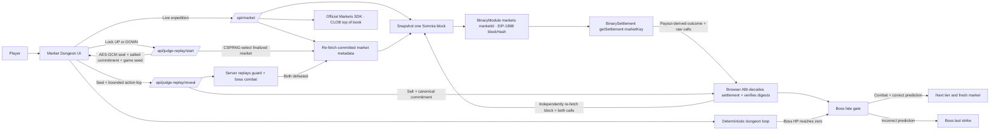

# Market Dungeon

Market Dungeon is a playable fantasy roguelite built for the **Somnia × dreamDEX Event Contracts Hackathon**. A live BTC 5-minute Event Contract becomes a dungeon omen: choose **Gold Awakens (UP)** or **Shadows Rise (DOWN)**, clear ten rooms, defeat the tier boss, and survive the finalized onchain outcome. Permanent victory requires both combat success and a correct prediction. If the 5-minute market is unavailable, discovery falls back safely to 15 minutes.

The current contest build is intentionally read-only. It reads live market metadata, shows live UP/DOWN implied odds from the dreamDEX CLOB through the official Markets SDK, and independently derives finalized payouts through hash-pinned Somnia RPC calls to the deployed BinaryModule and BinarySettlement contracts at one RPC verification snapshot block. It never requests a wallet signature, token approval, or trade.

## Live demo

**Play:** https://market-dungeon.vercel.app

**Watch the 1:52 hackathon demo:** https://youtu.be/mZb3t6-mydo

**DoraHacks submission:** https://dorahacks.io/buidl/48083

**Immutable submission release:** https://github.com/CryptoMickle/market-dungeon/releases/tag/hackathon-submission-2026-v2

**Integration and SDK/docs feedback:** [docs/DREAMDEX_INTEGRATION_REPORT.md](docs/DREAMDEX_INTEGRATION_REPORT.md)

### Full live expedition

1. Inspect the live dreamDEX CLOB odds, then choose `GOLD AWAKENS` or `SHADOWS RISE` against the active BTC market.
2. Enter a tier and clear ten deterministic combat rooms.
3. Use potions and gold, including Quartermaster Kevin's shops after Room 5 and the boss.
4. Defeat the boss through normal combat, then reveal the dreamDEX result.
5. A correct prediction keeps the boss down, awards its gold plus a 50-gold prediction reward, and opens the next tier with a fresh BTC prediction.
6. An incorrect prediction triggers the defeated boss's fatal last strike and ends the run.
7. Clear all four tiers to win the full expedition.

Gold persists between runs. Potions have a hard maximum of five: a new run restores the three-potion starting amount, or preserves a higher remaining amount up to five. Attack and defense upgrades remain within the current run but reset for every new expedition.

### Two-minute Judge Demo

Select **2-MIN JUDGE DEMO · SEALED MARKET REPLAY** on the start screen. This mode:

- asks the judge to choose and lock `UP` or `DOWN` before any historical market is selected;
- uses server-side cryptographic randomness to choose a finalized, non-voided, traded BTC 5-minute market no more than seven days old from a balanced settlement pool, with the same requirements for the balanced 15-minute fallback;
- encrypts the selected market and locked direction with AES-256-GCM under a server-only key;
- returns only an opaque seal, a salted SHA-256 commitment and an independent public combat seed to the browser;
- fast-forwards Tiers 1–3 and Rooms 1–8, then starts with one wounded Tier 4 guard before the wounded final boss;
- records a bounded structured log of `Attack`, `Storm`, and `Potion` actions while the player defeats both the guard and boss;
- replays that log stateless on the server from the sealed `gameSeed` and refuses reveal unless both enemies were legitimately defeated; and
- reveals the full market proof, RPC verification snapshot block and payout, combat transcript digest, salt and canonical commitment input after **Reveal Boss Fate**. Before applying the recorded outcome, the browser independently re-fetches the block and both raw calls from Somnia RPC, requires exact byte matches, ABI-decodes the results, verifies every exposed settlement binding, and recomputes both digests. The snapshot proves contract state at reveal time; it is not claimed to be the block containing the original finalization transaction.

It is a fast replay, not a mocked settlement.

#### Judge verification checklist

1. Enter Judge Demo and confirm that no selected replay market ID, address, strike, expiry or outcome is present before the choice. The visible opening line belongs to a separate live market, is labeled as context only, and does not identify the replay.
2. Choose `UP` or `DOWN`, then press **Lock Omen & Seal Replay**.
3. Note the full SHA-256 commitment shown during combat, then defeat the wounded guard and boss.
4. Press **Reveal Boss Fate**. The server first replays the combat transcript, then reads the BinaryModule market binding and BinarySettlement payout with both calls pinned to one canonical Somnia block hash.
5. Confirm that the proof panel reports an EIP-1898 hash-pinned browser RPC re-fetch and exposes the block hash, payout vector, market key, deployed contracts, and reproducible `eth_call` inputs/results.
6. Use **Share run + proof**, **Copy proof JSON**, or **Download proof JSON**. The portable artifact contains the canonical commitment input, complete combat transcript, digest, block hash, contracts, and both raw RPC calls/results.
7. Open the block and contract links in the Somnia explorer. No wallet, approval, order or other transaction is requested.

## Why Event Contracts fit the game

Market Dungeon combines skill and prediction without turning the prediction into an attack:

- **Dungeon result:** deterministic player actions, damage, healing, inventory, and room progression.
- **Market result:** dreamDEX decides whether a combat-defeated boss stays down permanently.

A correct prediction cannot replace combat victory, while combat victory alone cannot clear a tier. The two independent conditions meet only after the boss reaches zero HP.

## Adoption path

Market Dungeon is designed as a consumer on-ramp to Event Contracts rather than another professional trading terminal:

- **Today:** any judge or player can experience real live and finalized dreamDEX markets without a wallet, funds, approvals or jurisdiction-sensitive transaction flow.
- **Engagement loop:** every dungeon tier prefers a fresh BTC 5-minute Event Contract, so the market can settle inside the play session and produce a visible, memorable consequence.
- **Next step:** an optional wallet-enabled mode can let eligible players place an exact-amount Event Contract order before entering the dungeon, with simulation, maximum-loss disclosure and a separate confirmation for every write.
- **Expansion:** additional assets, intervals and seasonal campaigns can turn new dreamDEX markets into new game content without replacing the underlying combat loop.

The contest build does not claim to generate trading volume. It demonstrates the acquisition and engagement layer that can bring game-native users to Event Contracts before an explicitly consented trading mode is added.

## Architecture



### Trust boundaries

- The browser never receives a private key.
- The app sends no approval, order, redemption, or other transaction.
- Replay responses use `cache-control: private, no-store, max-age=0`.
- Live market hydration verifies Somnia chain ID `5031`; Judge Replay repeats that chain verification when the sealed settlement is revealed.
- Judge Replay selection is randomized across finalized, non-voided, traded BTC 5-minute markets rather than exposing the latest settlement; a balanced 15-minute pool is the automatic fallback.
- Replay start requires recent, positively traded candidates for both possible outcomes and applies the same seven-day age and provenance rules to the 5- and 15-minute pools. It fails closed if either selected pool is one-sided.
- No selected replay market identifier or identifying metadata is returned at lock time.
- The selected market's ID, BTC/binary template, interval, question, trading window, finalized/traded state, operator/venue/oracle/creator origin, creation transaction, recorded outcome and locked direction are authenticated inside an AES-256-GCM seal under `JUDGE_REPLAY_SEAL_KEY` and a version-2 SHA-256 commitment.
- The public commitment is salted, combat randomness is independent of the hidden market, and the salt is withheld until reveal.
- The reveal payload is limited to 8 KiB and 64 structured combat steps. Extra fields, invalid room transitions, impossible potion use, player death, incomplete combat, and post-terminal actions fail closed.
- The reveal server deterministically replays every Judge `Attack`, `Storm`, and `Potion` action and requires both the guard and boss to be defeated before it reads or returns settlement data.
- After combat passes, the reveal route re-fetches the exact indexed market, snapshots one Somnia block number and hash, and performs both settlement calls with the EIP-1898 reference `{ blockHash, requireCanonical: true }`. A reorg that makes the hash non-canonical causes the RPC read to fail closed.
- `BinaryModule.markets(marketId)` binds the committed market to its oracle question ID, origin operator and venue, creator, trading window, market, pool, collateral, and YES/NO IDs. The YES ID deterministically yields the settlement `marketKey`, encoded pool, and nonce.
- `BinarySettlement.getSettlement(marketKey)` must be finalized and match those bindings. The server derives UP/DOWN from its payout vector and fails closed on any indexer, contract, block, payout, void, or committed-outcome mismatch.
- Every terminal live result—either `finalized` or `voided`—must return that matching direct settlement proof. The browser repeats and validates the proof before applying gold, victory, death, or tier progression; an unavailable or mismatched proof leaves the boss fate pending.
- The browser independently re-fetches Somnia chain ID, the exact block by hash, and both raw `eth_call` results from the hardcoded public RPC using the same canonical EIP-1898 block reference. It requires byte-for-byte equality with the server proof, ABI-decodes both results, and validates the expected deployments, market ID and market-key calldata, token/pool/nonce encoding, block hash, payout vector, outcome, combat digest, and salted commitment before applying the result.

## Verified integration surface

Verified against Somnia mainnet on 2 September 2026:

| Surface | Value |
| --- | --- |
| Somnia chain ID | `5031` |
| Somnia explorer | `https://explorer.somnia.network` |
| dreamDEX indexer | `https://prd.smk.somnia.host/v1/graphql` |
| dreamDEX Markets SDK | `@somnia-chain/markets-sdk` `^0.25.0` |
| Somnia RPC | `https://api.infra.mainnet.somnia.network` |
| BinaryModule | `0x3ecC694Cef705358864a646142ac17A90E29e388` |
| BinarySettlement | `0xbF4a49e0Dfd092e5FBE8E5761064C49533e6Ed23` |
| USDso collateral | `0x00000022dA000002656c64D9eA6011ea952D008A` |
| Market filter | `BINARY` · `BTC` · `300` seconds preferred · `900` seconds fallback |
| Live implied odds | CLOB best bid / best ask midpoint; one-sided quote or last trade fallback |
| Direct settlement read | `BinaryModule.markets(bytes32)` → `BinarySettlement.getSettlement(uint256)` at one RPC verification snapshot block |
| Verified settlement fields | `finalized`, `voided`, `pool`, `collateralToken`, `nonce`, `payoutNumerators` and payout-derived winner |

Active-market discovery uses dreamDEX's indexer and prefers the current BTC 5-minute window. If none is active, it selects the 15-minute candidate closest to six minutes remaining. The server uses the official Markets SDK to read the selected market's recycle-safe, market-ID-keyed CLOB top of book. The UI derives UP from the best bid/ask midpoint and DOWN as its complement, labels one-sided or last-trade fallbacks, and refreshes the no-store snapshot every 15 seconds. Opening strike resolution follows `MarketReferenceLink.referenceQuestionId` to `OracleAnswer.numericValue`. Pool parameters and finalized settlement proofs are read directly through Somnia RPC.

See the concise [dreamDEX Integration Report](docs/DREAMDEX_INTEGRATION_REPORT.md) for the exact GraphQL fields, active/finalized discovery rules, RPC verification, metadata/settlement boundary, cache and security limits, documentation gaps, and recommended improvements.

## Local development

Requirements: Node.js 22.13 or newer.

```bash
npm install
npm run dev
```

Then open the local URL printed by the development server.

### Validation

```bash
npm run lint
npm test
npm run build
```

## Project structure

```text
app/
  clob-odds.ts          Pure implied-odds derivation and formatting
  event-contract-interval.ts 5m-first selection, labeling, and 15m fallback
  onchain-settlement-proof.ts Browser-side direct-proof binding validation
  api/dreamdex.ts       Shared server-only dreamDEX and Somnia reads
  api/dreamdex-odds.ts  Official Markets SDK top-of-book read with fallback
  api/market/route.ts   Live market discovery and settlement lookup
  api/judge-replay/     Encrypted replay start, reveal and commitment logic
  globals.css           Responsive game presentation
  layout.tsx            Metadata and social preview configuration
  page.tsx              Complete ten-room game and Judge Demo state machine
public/
  assets/                Canonical gold coin and Market Dungeon homepage hero
  characters/            Travelling merchant artwork
  monsters/              Four progression tiers for each enemy class
docs/
  DORAHACKS_SUBMISSION.md Submission-ready project description and judge path
  DREAMDEX_INTEGRATION_REPORT.md Exact implemented integration surface and gaps
```

## Safety and current limitations

- Event Contracts use real assets on mainnet; this contest build does not trade.
- The interface must not be used to bypass dreamDEX eligibility or jurisdiction checks.
- A future wallet-enabled mode should use exact-amount approval, transaction simulation, explicit maximum-loss disclosure, and separate user confirmation for every write.
- Gold and the next-run potion count are stored only on the player's device; active combat and loadout state reset on refresh.
- Judge combat is rendered in the browser, but reveal is server-gated by a stateless deterministic replay of the submitted structured action log. This proves that the transcript is valid under the published seed and rules; because the seed is public, it is not proof of human input or elapsed play time.
- Production and Preview require separate `JUDGE_REPLAY_SEAL_KEY` values, each encoded as exactly 64 hexadecimal characters (32 bytes). Rotating a key cleanly invalidates in-flight replay seals.
- Vercel Web Analytics records normal page views plus three anonymous funnel checkpoints as manual pageviews: Judge Demo started, verified Judge Demo completed, and Continue on dreamDEX clicked. Stable `/funnel/...` paths encode only interval, mode, direction, and result so 5m adoption remains measurable on Vercel Hobby, where custom events are unavailable; no wallet, market ID, commitment, or combat transcript is sent.
- Availability depends on the public dreamDEX indexer and Somnia RPC.

## Contest status

- Playable deployed experience: complete
- Live active-market integration: complete
- BTC 5m-first selection with automatic 15m fallback: complete
- Official dreamDEX Markets SDK CLOB odds: complete
- Hash-pinned, direct-RPC BinarySettlement verification at an RPC verification snapshot block: complete
- Two-minute judge path: complete
- Salted pre-reveal commitment, working block/contract links, copyable market ID, and portable post-reveal proof JSON: complete
- Stateless server-verified Judge combat transcript: complete
- Share/copy/download verified post-reveal proof artifact: complete
- Implementation-specific dreamDEX integration report: complete
- Desktop and 390 px mobile judge-flow QA: complete
- Four-tier dual-condition progression: complete
- 1:52 hackathon demo video: complete
- Wallet writes: intentionally disabled

## License

MIT
